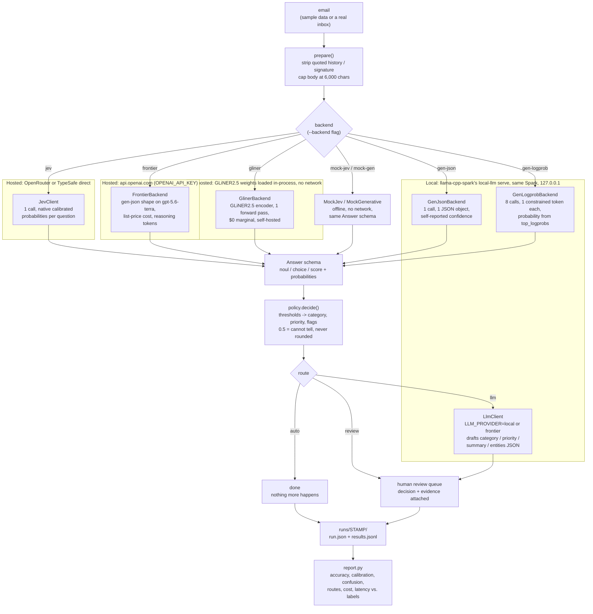

# jev-email-cascade

Proof of a specific cascade for email triage: **TypeSafe's Jev decides, ordinary code routes, a
local generative model handles what's left over.** Jev is not a chat model — it takes a block of
text and a set of typed questions and returns typed answers with calibrated probabilities, no
prose, no parsing layer. This project runs that cascade end to end against 74 synthetic,
labelled business emails, scores it, and — because the natural question is "why not just ask a
chat model the same questions" — runs that comparison too, on the same data, through the same
report: against a local gpt-oss-120b **and** against a hosted frontier model (OpenAI
`gpt-5.6-terra`), so the accuracy-per-dollar row everyone actually wants is in the same table.

## Architecture



Nothing in this project builds or launches a model server. `D2`, `D3`, and `H3` are plain HTTP
clients (`httpx`) pointed at `LLM_BASE_URL` — `llama-cpp-spark`'s `local-llm serve` already opened
that port before this ever runs. `D1` and `D5` are the nodes that leave the box (and `H3` too when
`LLM_PROVIDER=frontier`); only the typed questions and the prepared email text cross that
boundary, never a raw customer inbox dump.

## What this proves

```
email --> prepare (strip quoted history/signature, cap length)
       --> DECIDE: one backend answers 8 typed questions in parallel
              - jev          Jev via OpenRouter/TypeSafe: 1 call, native probabilities
              - gen-json     a chat model: 1 call, 1 JSON object, self-reported confidence
              - gen-logprob  a chat model: 8 calls, 1 constrained token each, probability
                             read from the model's own top_logprobs
              - frontier     gpt-5.6-terra (OpenAI): the gen-json shape at list price, the
                             reference row -- hosted reasoning models refuse logprobs
              - gliner       GLiNER2.5 (open-weight, self-hosted): a bidirectional encoder
                             answering all 8 questions in one forward pass, $0 marginal
       --> POLICY: thresholds in plain Python decide auto / review / llm
              - a Noul at 0.5 means "cannot tell", not "somewhat" -- never rounded
              - a Score with confidence 0.0 is a flat distribution -- never acted on
              - injection_suspected always forces review, even with an LLM configured
       --> auto: nothing more happens
           review: queued for a human, with the decision's evidence attached
           llm: an OpenAI-compatible endpoint (e.g. gpt-oss-120b) drafts a category/priority/
                summary/entities JSON for the reviewer
       --> REPORT: accuracy, calibration, confusion, routes, cost, latency, all against labels
```

Everything downstream of "decide" reads one shared `Answer` schema
(`src/jev_email_cascade/backends.py`), so the policy, the LLM hook, and the report never know
which backend produced an answer.

## Quickstart

```bash
uv sync
uv run cascade demo                    # mock Jev vs mock generative, no key needed, ~1s
```

`demo` runs both mocks over the full 74-email set and prints a `compare` table at the end. To
regenerate the sample data (deterministic, seed 0):

```bash
uv run python scripts/make_emails.py   # writes data/emails.jsonl
```

### Running the real Jev

```bash
cp .env.example .env
# paste an OpenRouter key into OPENROUTER_API_KEY (https://openrouter.ai/keys) --
# no TypeSafe account or waitlist needed, Jev is served there today.
uv run cascade run --backend jev --limit 1     # sanity check: one call, ~$0.00003
uv run cascade run --backend jev               # the full 74 emails, well under a cent
uv run cascade report runs/<the-new-stamp>
```

### Pointing the LLM hook and the generative backends at a served model

This project is meant to run on the same DGX Spark that
[`llama-cpp-spark`](https://github.com/skiingfalcon/llama-cpp-spark) serves models on, so once
`uv run local-llm serve gpt-oss-120b` is running there, `LLM_BASE_URL` is loopback — no llama.cpp
build in this repo, no network hop, just an HTTP client pointed at the port that command opened:

```bash
LLM_BASE_URL=http://127.0.0.1:8082/v1
LLM_MODEL=gpt-oss-120b
```

(Running this from a different machine than the one serving the model is the same idea with a
real hostname instead of `127.0.0.1` — the client doesn't care either way.)

```bash
uv run cascade run --backend jev --llm         # Jev decides; uncertain items go to gpt-oss-120b
uv run cascade run --backend gen-json --limit 5    # gpt-oss-120b answers all 8 questions itself
uv run cascade run --backend gen-logprob --limit 5 # gpt-oss-120b, 8 constrained calls, real logprobs
```

Without `LLM_BASE_URL` set, `--llm` degrades cleanly: escalations are queued for `review` instead
of calling anything, and the run still completes.

### Running the frontier comparison (OpenAI `gpt-5.6-terra`)

```bash
# .env: OPENAI_API_KEY=sk-...   (same variable llama-cpp-spark reads; one .env serves both)
uv run cascade run --backend frontier --limit 1        # preflight GET /models/gpt-5.6-terra, 1 call
uv run cascade run --backend frontier                  # all 74, ~$0.35 at list price
uv run cascade run --backend frontier --reasoning-effort low   # override the provider default
uv run cascade compare runs/<jev> runs/<frontier> runs/<gen-json> --markdown
```

`frontier` is `gen-json` pointed at a hosted reasoning model, with the request conventions that
API needs (`max_completion_tokens`, no `temperature`, top-level `reasoning_effort`, retries on
429/5xx honouring `Retry-After`) and `usage.completion_tokens_details.reasoning_tokens` recorded
per email. There is no `frontier-logprob`: the model returns no `logprobs`, and the client
refuses the request up front rather than paying for a call that cannot answer the question. Cost
is list-price arithmetic from token counts (`FRONTIER_PRICE_*_PER_MTOK`, recorded into
`run.json` as `pricing`), because the API reports tokens, not dollars.

The escalation hook can run on the same model — `LLM_PROVIDER=frontier uv run cascade run
--backend jev --llm` — so "Jev + gpt-oss" and "Jev + Terra" on exactly the escalated band are one
`compare` apart (`llm hook $` column, `llm_cost_usd` / `llm_reasoning_tokens` in `run.json`).

### Running the open-weight comparison (GLiNER2.5, self-hosted, $0 marginal)

[`fastino/gliner2.5-multi-v1`](https://huggingface.co/fastino/gliner2.5-multi-v1) is the
legitimate free/open-weight comparison, not a strawman: it is the same *class* of model as
Jev — a bidirectional encoder that takes text and a schema of typed labels and returns labels
with scores in one forward pass, no generation, no output parsing — except Apache-2.0 licensed
(287M params, mDeBERTa-v3-base encoder) and self-hosted at $0 marginal cost. It is the local
decision model the data-hosting caveat below points at.

```bash
uv sync --extra gliner                          # pulls torch, ~2 GB; not in the default install
uv run cascade run --backend gliner --limit 3   # sanity check on CPU
uv run cascade run --backend gliner             # all 74 emails
uv run cascade compare runs/<jev> runs/<gliner> --markdown
```

On the Spark, `GLINER_DEVICE=cuda GLINER_FP16=1 uv run cascade run --backend gliner` for the GPU
latency row; `scripts/spark-gliner-run.sh` runs the smoke test, the full run, and commits
`runs/<stamp>/` in one step (no API key of any kind — the weights are pulled once, anonymously,
from Hugging Face, then everything is offline).

`questions.py` maps onto GLiNER2's schema directly: `category` and `priority` become single-label
classification tasks over their existing option/level text; each Noul becomes a `true`/`false`
task with the instruction sentence folded into both labels' descriptions, since GLiNER has no
separate slot for free-text scope or negation the way Jev's `instructions` field does. GLiNER2's
API also only exposes the *winning* label's confidence, not the full distribution; for the 2-way
Noul tasks that's no loss (`P(false) = 1 - P(true)` is exact), but for the 8-way category and
4-way priority tasks the rest of the distribution is reconstructed by spreading the remaining
mass uniformly — an honest placeholder, not a measurement. Rows where this happened are flagged
`probabilities_reconstructed: true` in `results.jsonl` so the report never mistakes it for a
calibrated distribution the way it can for Jev's or `gen-logprob`'s.

## Jev vs a generative model, on the same questions

This is the comparison the project exists to run, not just Jev's own accuracy. Five backends
answer the identical 8-question contract (`src/jev_email_cascade/questions.py`) about the
identical emails:

| | calls / email | probability source | cost driver |
| --- | --- | --- | --- |
| `jev` | 1 | native, calibrated | $0.042 / M input tokens, output free |
| `gen-json` | 1 | self-reported `"confidence"` in the JSON it returns | your hosted price (local gpt-oss: $0 marginal) |
| `gen-logprob` | 8 (one per question) | the model's own `top_logprobs` on a forced single token | 8x the prompt tokens |
| `frontier` | 1 | self-reported `"confidence"` (no `logprobs` offered) | $2 / M in, $12 / M out incl. hidden reasoning tokens |
| `gliner` | 1 | native classification score per label (softmax), same class of model as Jev | $0 marginal, self-hosted |

Run them (mock or live) and compare:

```bash
uv run cascade run --backend mock-jev
uv run cascade run --backend mock-gen                # gen-json shape, offline
uv run cascade compare runs/<jev-stamp> runs/<gen-stamp> [runs/<frontier-stamp>] [--markdown]
```

`compare` puts accuracy, calls per email, tokens in / out (reasoning), total and per-1K cost, the
escalation hook's cost, latency and errors side by side, one row per run.

`cascade report --markdown` on each run also shows, per Noul question, the **raw accuracy**
(threshold at 0.5), the **acted accuracy** (only the items confident enough for the policy to act
on, out of how many), and the **mean confidence on wrong answers** — the number that would tell
you a backend is confidently wrong rather than honestly unsure.

**What we found running this on our own mock backends** (a real `jev` vs `gen-json`/`gen-logprob`
comparison will differ, and is the point of running it for real): `gen-json`'s self-reported
confidence for yes/no questions came back essentially flat (models rarely have a native way to
express calibrated uncertainty about a boolean they typed as text), which meant almost none of
its Noul answers cleared the policy's acting threshold in either direction — every one landed in
"uncertain" and escalated, whether the underlying answer was right or wrong. `gen-logprob` doesn't
have this problem, because the probability comes from the token's own log-probability rather than
a number the model typed, but it costs 8 calls instead of 1. That gap — a real one, not asserted
in the pitch above but reproduced by this run — is exactly why TypeSafe frames Jev as a class of
model, not a better-prompted chat model: getting a genuinely calibrated probability out of a
generative model at all requires either constrained single-token decoding (`gen-logprob`, 8x the
cost here) or trusting a self-reported number that this run found to be close to useless for
routing.

## Why Jev and not chat completions

Jev is not reachable through `/chat/completions`. Both routes take the same body:

```
POST https://openrouter.ai/api/alpha/decisions        (or https://api.typesafe.ai/v1/systemone)
Authorization: Bearer $OPENROUTER_API_KEY
{"model": "typesafe/jev-1.13", "state": {...}, "questions": {...}}
```

`state` is the prepared email (`subject`, `from`, `received`, `body`); `questions` is a map of
named `Noul` / `Choice` / `Score` objects (`src/jev_email_cascade/questions.py`); the response is
a map of the same keys back, each with a probability or a `confidence`, plus `usage.input_tokens`
and, when OpenRouter reports it, `usage.cost`. `src/jev_email_cascade/jev_client.py` handles both
routes (TypeSafe direct takes precedence when both keys are set, so a stray `OPENROUTER_API_KEY`
never silently re-bills a different account) and retries on 429/5xx/529 honouring `Retry-After`.

## Why the LLM hook is optional

Jev cannot write anything — no summary, no extracted entity, no drafted reply. Something has to
handle the band the policy escalates (an uncertain category or priority, or anything flagged
`needs_decision` / `dissatisfied`). That is exactly the shape of "Claude or GPT decides what
questions are worth asking, Jev answers them at scale" from the other direction: a generative
model earns its place only where text has to be produced or a genuinely open-ended judgment call
has to be made, not for the classification itself. `LLM_BASE_URL` unset means every escalation
goes to a human review queue instead; nothing crashes, nothing calls out.

## Cost

At $0.042 per million input tokens, output free (`uv run cascade estimate`):

| volume | tokens (@ ~800/email) | cost | per 1K emails |
| --- | --- | --- | --- |
| 1,000 emails | 800,000 | $0.034 | $0.034 |
| 100,000 emails | 80,000,000 | $3.36 | $0.034 |

The 74-email sample set costs about half a cent end to end. Retagging the whole set again after
changing a question costs the same again — that reversibility, not the per-call price, is the
actual pitch: tag for today's questions, retag when the business changes, instead of trying to
predict every question up front.

The same 74 emails through `gpt-5.6-terra` at list price ($2 / M input, $12 / M output, the
reasoning tokens billed as output): roughly 67K input + ~18K output ≈ **$0.35**, about 90x Jev,
before any escalation-hook calls. The `frontier` run's `run.json` records the exact token counts
and the prices used, so the ratio in your report is measured, not this estimate.

## Data-hosting caveat

Jev is a hosted API with, as of this writing, no on-prem or open-weight option — every call
round-trips to a US-hosted service run by one vendor. The `frontier` backend (and the hook with
`LLM_PROVIDER=frontier`) sends the same prepared email text to OpenAI — the same egress class,
a different vendor. That's a fine trade for synthetic or public data; for real customer email it's
a compliance decision first. If the answer is no, the cascade's
shape doesn't change: `src/jev_email_cascade/backends.py` defines the `DecisionBackend` protocol
every backend implements, so a local decision model — a small model on your own hardware answering
the same typed questions with constrained output — plugs into the exact same policy, LLM hook, and
report that `MockJev` exercises today. `--backend gliner` (above) is that seam filled in for
real, not just a test fixture: nothing leaves the box, and the run's cost is $0 by construction.

## Gotchas (from TypeSafe's own docs and from running this)

- **Instructions are read literally.** Negation and scope have to be explicit in the question
  text (see `dissatisfied`'s wording, and the negation cases in `scripts/make_emails.py`).
- **Every `Choice` needs an escape option.** Without `other`, an out-of-taxonomy email gets a
  confident wrong answer instead of a low-confidence one.
- **Send only what a question needs.** `prepare()` strips quoted history and signatures and caps
  the body at 6,000 characters; accuracy falls with padding.
- **Pin the model once thresholds are tuned.** `jev-latest` / `typesafe/jev-1.13` float; a dated
  build id (echoed back in every response's `model` field) does not.
- **`~typesafe/jev-latest` currently lists no serving endpoint on OpenRouter** — use
  `typesafe/jev-1.13` (the default in `.env.example`) or a specific dated build.
- **Probability map keys can arrive as strings** even for a `Score`'s numeric levels;
  `backends.Answer.from_json` normalises them.
- **A `Noul` at 0.5 is "cannot tell," not "maybe."** The policy treats anything between the
  mirrored thresholds as uncertain rather than rounding it.
- **The Decisions endpoint is on OpenRouter's `/api/alpha/` path** and may move; override with
  `JEV_DECISIONS_URL` if it does.

## How to read a run

`runs/<stamp>/run.json`: backend, model (as reported by the response, not requested), thresholds
questions were hashed against, total cost, cost per 1K emails, calls per email, token totals
(input / output / cached / reasoning), the `pricing` triple and `reasoning_effort` a hosted run
used, latency p50/p95, the escalation hook's provider / model / calls / cost, route counts, error
count. `runs/<stamp>/results.jsonl`: one row per email — labels, every raw
answer, the policy's decision (category/priority/flags/route), and the LLM's output when called.
`uv run cascade report runs/<stamp>` turns that into the accuracy/calibration/confusion tables
above; `--markdown` prints the same thing as a pasteable table.

## Project layout

```
data/emails.jsonl              74 labelled synthetic emails (generated, committed)
scripts/make_emails.py         deterministic generator -- same seed, same file, every time
src/jev_email_cascade/
  questions.py                 the 8-question contract every backend answers
  prepare.py                   strip quoted history/signature, cap length
  backends.py                  the shared Answer schema and DecisionBackend protocol
  jev_client.py                Jev via OpenRouter or TypeSafe direct
  mock_jev.py                  offline stand-in for Jev; also the seam for a local decision model
  generative.py                gen-json / gen-logprob / frontier backends, the shared chat client
                               (local vs openai request profiles, retries, Pricing), MockGenerative
  gliner_backend.py            GLiNER2.5 backend: derives a schema from questions.py, $0 marginal
  policy.py                    thresholds -> auto / review / llm
  llm_client.py                the optional generative hook (gpt-oss-120b, or Terra via LLM_PROVIDER)
  pipeline.py                  wires one backend to the email set, writes runs/<stamp>/
  report.py                    scores a run against labels; compares runs
  cli.py                       cascade demo | run | report | compare | questions | estimate
tests/                         no network: httpx.MockTransport throughout
```
