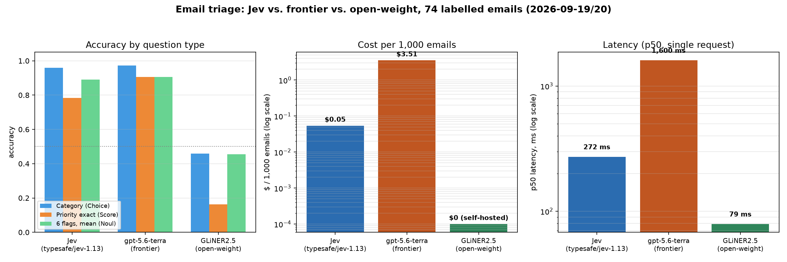

# Email triage: Jev vs a frontier model vs an open-weight model — CTO brief

*Measured 2026-09-19/20 on the same 74 labelled business emails, the same 8 typed questions, the
same scoring code. Runs: [`runs/20260919T131239Z`](../runs/20260919T131239Z/report.md) (Jev),
[`runs/20260919T184646Z`](../runs/20260919T184646Z/report.md) (gpt-5.6-terra), and
[`runs/20260920T012913Z`](../runs/20260920T012913Z/report.md) (GLiNER2.5, open-weight,
self-hosted on the Spark's GPU). Reproduce with `uv run cascade compare
runs/20260919T131239Z runs/20260919T184646Z runs/20260920T012913Z --markdown`.*

## The elevator pitch

**A purpose-built decision model (TypeSafe Jev) classifies email at 1/65th the cost and 6x the
speed of a frontier LLM, with statistically indistinguishable accuracy — and, unlike the LLM, it
tells you when it is unsure.** The frontier model is more accurate on priority, but it was
confidently wrong on the emails it missed; Jev's misses were all flagged as low-confidence. A
free, self-hosted open-weight model (GLiNER2.5) was also tried as the same class of model as
Jev — an encoder returning typed answers, no generation — and is faster and free, but scored far
worse across the board; the likely cause is in our integration, not necessarily the model, and is
called out below rather than smoothed over.

## The three question types, and how each model did on them

Every backend answers the same 8 questions, each one of three types (see
[`questions.py`](../src/jev_email_cascade/questions.py)):

- **Choice** — pick one option from a fixed list (`category`: support, sales, billing, hr,
  vendor, internal, spam, other), returned with a confidence.
- **Score** — a position on an ordered scale, 4 levels (`priority`: 0 = no action, 3 = act within
  two days), returned as a probability-weighted expectation across the levels.
- **Noul** — a yes/no question answered as a *probability*, not a boolean (the 6 flags:
  `awaiting_reply`, `deadline_present`, `dissatisfied`, `needs_decision`, `opportunity`,
  `injection_suspected`). 0.5 means "cannot tell," not "somewhat."

| question type | Jev | gpt-5.6-terra (frontier) | GLiNER2.5 (open-weight) |
| --- | ---: | ---: | ---: |
| **Choice** — category accuracy | 95.9% (CI 91–100) | 97.3% (CI 93–100) | 45.9% |
| **Score** — priority exact / within-1 | 78.4% / 91.9% | 90.5% / 100% | 16.2% / 70.3% |
| **Noul** — 6 flags, mean raw accuracy | 89.0% | 90.5% | 45.5% (≈ coin flip) |

## Scorecard

| | **Jev** (typesafe/jev-1.13) | **gpt-5.6-terra** (OpenAI) | **GLiNER2.5** (open-weight) | edge |
| --- | ---: | ---: | ---: | :--- |
| **Cost, 74 emails** | $0.004 | $0.260 | $0.00 | GLiNER free; Jev **65x** cheaper than Terra |
| **Cost per 1K emails** | $0.054 | $3.51 | $0.00 (self-hosted) | |
| **Cost per 1M emails / month** | ~$54 | ~$3,510 | ~$0 + our GPU time | |
| **Latency p50 / p95** | 272 / 449 ms | 1,600 / 3,705 ms | **79 / 94 ms** | GLiNER fastest |
| **Wall time, 74 emails (serial)** | 21 s | 139 s | **6.4 s** | GLiNER fastest |
| **Category accuracy (Choice)** | 95.9% | 97.3% | 45.9% | Jev / Terra, decisively |
| **Priority exact / within-1 (Score)** | 78.4% / 91.9% | 90.5% / 100% | 16.2% / 70.3% | Terra |
| **6 flags, mean accuracy (Noul)** | 89.0% | 90.5% | 45.5% | Jev / Terra, decisively |
| **Confidence on wrong category calls** | 0.39, 0.46, 0.65 — *"not sure"* | 0.96, 0.93 — *"certain"* | not evaluated | **Jev, decisively** |
| **Auto-routed items with zero errors** | 4 / 4 | 18 / 26 | 1 / 1 | Jev / GLiNER clean; Terra 8 misses |
| **Calls per email** | 1 | 1 | 1 | |
| **Output tokens to parse** | 0 (typed answers) | 9,733 (+1,451 hidden reasoning) | 0 (typed answers) | Jev / GLiNER |
| **Errors / retries** | 0 | 0 | 0 | |

## What this means

1. **Cost and speed are not close, in either direction.** Jev's entire pricing is $0.042 per
   million input tokens with no output charge — two orders of magnitude cheaper than the frontier
   model at any volume worth automating. GLiNER2.5 undercuts even that: it runs on our own GPU at
   $0 marginal cost and answered all 74 emails in 6.4 seconds, 3–4x faster than Jev and ~20x
   faster than the frontier model.

2. **Accuracy is a wash between Jev and the frontier model.** Their 74-email confidence intervals
   overlap on category and on the yes/no flags. Terra wins on priority (90.5% vs 78.4% exact) —
   mostly by reading routine calendar times ("stand-up moved to 10am") as non-urgent where Jev
   over-triggered.

3. **GLiNER2.5's accuracy is not usable as measured, and its Noul score is the tell.** 45.5% mean
   accuracy on plain yes/no questions is barely better than a coin flip — a properly-instructed
   model, even a small one, should do much better on questions like "does this email state a
   deadline?" That specific failure mode points at our integration: GLiNER2 takes label
   *descriptions*, not just label names, and the wiring that turns `questions.py`'s instruction
   text into those descriptions has an untested fallback path that could be silently sending it
   bare option names instead (`billing`, `internal`, ...) with no criteria attached. Category
   predictions cluster hard on `internal` and `vendor` (36 and 16 of 74 predictions, vs 9 true
   each) — consistent with the model guessing from label names alone. **This row should be read
   as "our first integration attempt," not "what a well-instructed open-weight encoder can do."**
   It is flagged here rather than left out because the raw number, unexplained, would understate
   a real free alternative and overstate Jev's structural advantage.

4. **Calibration is the differentiator that survives the caveats above.** Jev returns a
   probability; a frontier model returns a number it typed. When Jev got a category wrong it
   reported 0.39–0.65 and the policy sent it to review. When Terra got one wrong it reported
   0.93–0.96 and would have been auto-filed. Of the 26 emails Terra's confidence said were safe to
   automate, 8 had at least one wrong flag; Jev's 4 auto items were all clean. Self-reported LLM
   confidence is not a routing signal; Jev's is.

5. **The cascade is the design, not a compromise.** Jev (or, pending the fix above, a corrected
   GLiNER2.5) handles the volume; an LLM (local gpt-oss-120b on the Spark, or Terra via
   `LLM_PROVIDER=frontier`) is called only for the band marked uncertain, and only there does the
   higher-accuracy model earn its cost. The pipeline already does this; the hook is a config flag.

## Caveats, stated plainly

- 74 synthetic emails, one run each per backend. Enough to see a 65x cost gap; not enough to rank
  Jev and Terra within 2 points of accuracy, and not enough to certify GLiNER2.5's ceiling once
  the label-description bug (if that's what it is) is found and fixed.
- Jev currently escalates 70/74 emails, almost entirely because the `needs_decision` question is
  worded too loosely (37 of 74 land in its "can't tell" band). That is a question-wording fix,
  not a model limitation, and it is the lever that decides the cascade's economics.
- Terra's cost is list-price arithmetic on the API's token counts (the API reports tokens, not
  dollars). Jev's is what OpenRouter billed. GLiNER2.5's is genuinely $0 marginal, excluding the
  GPU time and engineering already sunk into standing it up.
- Jev and Terra are both hosted US APIs; the prepared email text leaves the box in either case.
  GLiNER2.5 is the on-prem alternative — nothing leaves the box — which is the whole point of
  re-running it once the integration is fixed.

## Ask

1. **Before the volume re-run:** debug why GLiNER2.5's Noul accuracy is at chance level — confirm
   whether label descriptions are actually reaching the model (`src/jev_email_cascade/
   gliner_backend.py`'s schema-building fallback is the leading suspect). A free, on-prem model
   performing anywhere near Jev's accuracy changes this brief's recommendation.
2. **Then, approve a volume re-run** (10K real, de-identified emails; Jev ≈ $0.50, Terra ≈ $35,
   GLiNER2.5 ≈ $0) after the `needs_decision` wording fix, with the cascade's escalation arm on
   gpt-oss-120b. That produces the number the business case needs: **cost per correctly-routed
   email, at production volume** — across a paid hosted option, a paid frontier option, and a
   free self-hosted one.
